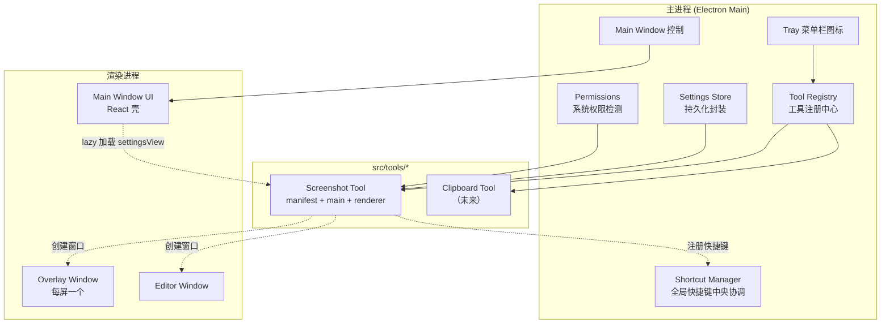
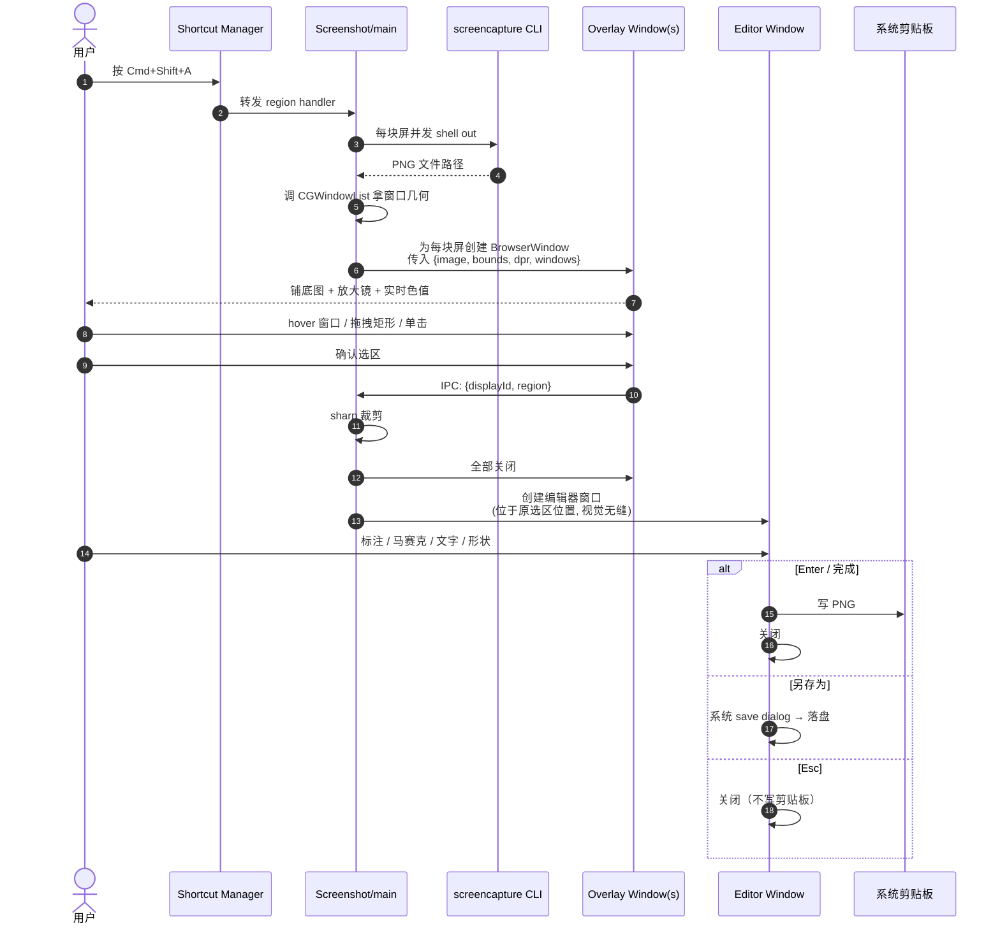

# Max Tools — 设计文档

**日期**：2026-06-17
**首期范围**：截图工具（含编辑器、取色、马赛克、文字、形状、快捷键配置）+ 多工具可扩展架构
**平台**：macOS 优先，架构预留 Windows 扩展点

---

## 1. 背景与目标

### 1.1 痛点
现有截图工具（除 macOS 系统自带）在截 **macOS 右键菜单 / 系统级浮层** 时，工具一启动就会让菜单消失。系统自带工具能截，但缺标注、取色、马赛克等编辑功能。

### 1.2 项目目标
做一个 **常驻的桌面工具集合**，首期实现一个能稳定截右键菜单的截图工具；同时把架构做成"插槽式"，后续可低成本加入其它个人工具（增强剪贴板、其它待定）。

### 1.3 成功标准
- 截图能稳定捕获 macOS 右键菜单、tooltip、光标
- 编辑器具备：矩形/椭圆/箭头/画笔/马赛克/模糊/文字 + 撤销重做
- 全过程取色（HEX/RGB），鼠标移动实时显示
- 多显示器下每屏独立选区
- 添加第二个工具的成本 = 新建一个 `src/tools/<name>/` 目录 + 实现 manifest 契约，不需要改主程序代码

---

## 2. 整体架构

### 2.1 应用形态
- **菜单栏常驻**（Tray icon）+ **可选打开的主窗口**
- 菜单栏图标点击展开工具菜单 + 全局快捷键触发
- 主窗口用于设置、工具开关、快捷键配置、查看日志

### 2.2 技术栈
- **Electron**（主框架）
- **React 18 + TypeScript + Vite**（渲染层）
- **electron-vite** 作为构建工具（同时打包 main / preload / renderer）
- **electron-store** 做设置持久化
- **electron-log** 做日志
- **sharp** 或 **jimp** 做图像裁剪（主进程内）
- 截屏调用 macOS 自带的 `screencapture` CLI（避开 Electron `desktopCapturer` 截不到菜单/光标的问题）
- 窗口几何检测调 macOS `CGWindowListCopyWindowInfo`（通过原生 node 模块或 `osascript` 包装，二选一在实现阶段确定）

### 2.3 扩展模式
**单仓库模块化**：每个工具是 `src/tools/<id>/` 下的一个目录，实现统一的 `ToolManifest` 契约。主程序的 `tool-registry` 在启动时扫描这些目录、读 manifest、调 `init`，工具之间互不感知。

### 2.4 模块全景



---

## 3. 目录结构

```
max-tools/
├── package.json
├── electron.vite.config.ts
├── tsconfig.json
├── docs/superpowers/specs/                  # 设计文档
├── src/
│   ├── main/                                # 主进程
│   │   ├── index.ts                         # 应用入口、生命周期
│   │   ├── tray.ts                          # 菜单栏图标
│   │   ├── main-window.ts                   # 主窗口创建
│   │   ├── tool-registry.ts                 # ⭐ 工具注册中心
│   │   ├── shortcut-manager.ts              # 全局快捷键中央协调
│   │   ├── settings-store.ts                # 持久化封装
│   │   ├── permissions.ts                   # 系统权限检测
│   │   └── ipc/                             # IPC 路由（按 tool 分组）
│   ├── preload/
│   │   └── index.ts                         # contextBridge 暴露受控 API
│   ├── renderer/
│   │   ├── main-window/                     # 主窗口 React app（壳）
│   │   │   ├── index.tsx
│   │   │   ├── App.tsx                      # 左侧导航 + 右侧 router
│   │   │   └── pages/
│   │   │       ├── tool-host.tsx            # 动态加载某工具的 settingsView
│   │   │       ├── general.tsx              # 通用设置（主题、开机启动等）
│   │   │       └── about.tsx
│   │   └── shared/                          # 跨工具复用
│   │       ├── components/
│   │       │   ├── ShortcutRecorder.tsx
│   │       │   ├── SettingRow.tsx
│   │       │   ├── Toggle.tsx
│   │       │   ├── FilePathPicker.tsx
│   │       │   └── ColorPicker.tsx
│   │       ├── hooks/
│   │       └── types/
│   ├── tools/                               # ⭐ 工具目录
│   │   └── screenshot/
│   │       ├── manifest.ts                  # 导出 ToolManifest
│   │       ├── main/                        # 主进程代码
│   │       │   ├── index.ts                 # init 入口
│   │       │   ├── capture.ts               # 调 screencapture
│   │       │   ├── window-detect.ts         # 调 CGWindowList
│   │       │   ├── crop.ts                  # 用 sharp 裁剪
│   │       │   ├── overlay-controller.ts    # 创建/销毁叠层窗口
│   │       │   └── editor-controller.ts     # 创建/销毁编辑器窗口
│   │       └── renderer/
│   │           ├── overlay/                 # 叠层 React app
│   │           │   ├── index.tsx
│   │           │   ├── Overlay.tsx
│   │           │   ├── Magnifier.tsx
│   │           │   └── lib/                 # 取色、选区计算
│   │           ├── editor/                  # 编辑器 React app
│   │           │   ├── index.tsx
│   │           │   ├── Editor.tsx
│   │           │   ├── canvas/              # 图层渲染
│   │           │   ├── toolbar/             # 工具栏
│   │           │   └── layers/              # 各种 layer 类型实现
│   │           └── settings/                # ⭐ 主窗口里的设置页
│   │               └── index.tsx            # export default React 组件
│   └── native/
│       └── mac/                             # macOS 原生胶水
└── tests/
    ├── unit/                                # vitest 单测
    └── manual-checklist.md                  # 手动验收清单
```

---

## 4. 工具注册契约（ToolManifest）

```ts
// src/main/tool-registry.ts

export interface ToolManifest {
  id: string                                  // 'screenshot'
  name: string                                // 显示名
  icon: string                                // 菜单栏 / 主窗口侧栏图标资源路径
  defaultShortcuts: Record<string, string>    // { region: 'Cmd+Shift+A', fullscreen: 'Cmd+Shift+F' }

  // 主进程注册期调用，一次性
  init: (ctx: ToolContext) => Promise<void>

  // 主窗口内的设置页（renderer 侧动态 import）
  settingsView: () => Promise<{ default: React.ComponentType<ToolSettingsProps> }>
}

export interface ToolContext {
  // 注册快捷键（走中央 shortcut-manager 校验 + 实际 register）
  registerShortcut: (key: string, combo: string, handler: () => void) => Promise<RegisterResult>

  // 命名空间隔离的持久化存储（key 自动加前缀 `tool.<id>.`）
  store: ScopedStore

  // IPC 注册（channel 自动加前缀 `tool/<id>/`）
  onIPC: <T = any>(channel: string, handler: (payload: T) => any) => void

  // 创建窗口（封装常用的 transparent overlay / editor window 配置）
  createOverlayWindow: (displayId: number, options: OverlayWindowOptions) => BrowserWindow
  createEditorWindow: (options: EditorWindowOptions) => BrowserWindow

  // 日志
  log: log.Logger
}

export interface ToolSettingsProps {
  store: ScopedStore                          // 同工具命名空间的读写
  shortcuts: ShortcutBinding[]                // 当前工具的快捷键状态
  setShortcut: (key: string, combo: string) => Promise<RegisterResult>
  toast: (msg: string, type?: 'info' | 'error') => void
}

export interface RegisterResult {
  ok: boolean
  conflictWith?: { toolId: string; key: string }  // 如果冲突，告诉用户和谁冲突
  reason?: string                                  // 其它失败原因（系统级被占用）
}
```

**主程序对 manifest 的处理：**
1. 启动时扫描 `src/tools/*/manifest.ts`
2. 对每个 manifest 创建一个 `ToolContext` 实例（绑定该工具的命名空间）
3. 调 `manifest.init(ctx)`，try/catch 隔离——某个工具 init 失败不影响其它工具
4. 把成功加载的 manifest 列表传给主窗口（用于侧栏渲染）

---

## 5. 截图工具运行时数据流

### 5.1 总流程



### 5.2 关键决策

| 决策 | 原因 |
|---|---|
| 用 `screencapture` 而非 Electron `desktopCapturer` | 后者截不到 macOS 系统级浮层（右键菜单、tooltip） |
| 叠层用 `` 铺底而非 canvas | 减少子像素插值、提升性能、最简单 |
| 取色从 ImageData 内存读 | mousemove 60fps 也无延迟 |
| 裁剪放主进程 | 避免十几 MB 位图反复跨进程 IPC |
| 多屏每屏独立叠层 | 避免拼接坐标系的复杂度，符合用户预期 |
| Retina 换算集中在一个 util | 避免散落 |

---

## 6. 编辑器（标注层）设计

### 6.1 数据模型 — 图层化 + 可撤销

```ts
type Layer =
  | { id: string; type: 'rect';    bounds: Rect; stroke: Color; strokeWidth: number; fill?: Color }
  | { id: string; type: 'ellipse'; bounds: Rect; stroke: Color; strokeWidth: number; fill?: Color }
  | { id: string; type: 'arrow';   from: Point; to: Point; stroke: Color; strokeWidth: number }
  | { id: string; type: 'pen';     points: Point[]; stroke: Color; strokeWidth: number }
  | { id: string; type: 'text';    pos: Point; content: string; fontSize: number; color: Color; fontFamily: string }
  | { id: string; type: 'mosaic';  region: { kind: 'rect'; bounds: Rect } | { kind: 'pen'; points: Point[]; radius: number }; blockSize: number }
  | { id: string; type: 'blur';    region: { kind: 'rect'; bounds: Rect } | { kind: 'pen'; points: Point[]; radius: number }; blurRadius: number }

interface EditorState {
  baseImage: ImageBitmap            // 已裁剪的截图
  layers: Layer[]
  selectedLayerId: string | null
  undoStack: Layer[][]              // 每次变更前 push 当前 layers snapshot
  redoStack: Layer[][]
  activeTool: ToolKind              // 当前工具栏选中
  currentStyle: { color, strokeWidth, fontSize, ... }
}
```

### 6.2 渲染
单个 `<canvas>`，每次 state 变更通过 `requestAnimationFrame` 重绘：
1. 画 `baseImage`
2. 按 `layers` 顺序逐个画
3. 画选中态句柄（如果有）

截图尺寸通常不大（< 4K），整张重绘性能没问题。

### 6.3 操作
| 输入 | 行为 |
|---|---|
| 选中工具 → 拖拽 | snapshot to undoStack → 生成新 Layer push 进 layers |
| 单击已有图层 | 选中（显示句柄，可拖动/改大小/改颜色） |
| `Cmd+Z` / `Cmd+Shift+Z` | undo / redo |
| `Delete` | 删除选中图层 |
| `Enter` 或点"完成" | flatten layers → PNG → 写剪贴板 → 关闭 |
| `Esc` | 关闭不复制 |
| "另存为"按钮 | 系统 save dialog → 落盘（PNG / 可选 JPG） |

### 6.4 工具栏

```
[选择] [矩形] [椭圆] [箭头] [画笔] [模糊▾] [文字]  │  [颜色] [线宽▾]  │  [↶] [↷]  │  [另存为] [完成]
```
[模糊▾] 是一个下拉，分两种：**马赛克 (pixelate)** 和 **高斯模糊 (gaussian)**。两种各对应一个 layer 类型。

### 6.5 特殊实现细节

- **马赛克 (pixelate)**：目标区域 nearest-neighbor 缩到 1/N 再放大回去
- **高斯模糊**：Canvas `filter: blur(Npx)` 或 stackblur 实现
- 两种都支持"路径区域"（画笔涂到哪儿就模糊到哪儿）和矩形区域
- 工具栏一个 [模糊▾] 入口，下拉选择"马赛克"或"高斯模糊"；当前选择持久化在编辑器 session（不写设置）
- **文字编辑**：弹出 `<input>` 浮层做编辑，失焦后渲染为 canvas 文字图层（避免在 canvas 内处理 IME 输入法）
- **取色器**：编辑器右上角按钮 → 进入取色模式 → 放大镜 + 色值 → 单击应用到当前画笔色
- **色值格式**：默认 HEX，下方小字给出 RGB；可在设置里改默认

---

## 7. 主窗口设计

### 7.1 布局

```
┌─────────────────────────────────────────────────────────┐
│  Max Tools                                              │
├──────────┬──────────────────────────────────────────────┤
│ 工具     │                                              │
│ ─────    │                                              │
│ ⚙ 截图   │     [tool-host: 动态加载该工具的 settingsView]│
│ ⊕ 添加…  │                                              │
│          │                                              │
├──────────┤                                              │
│ 设置     │                                              │
│ ─────    │                                              │
│ 通用     │                                              │
│ 关于     │                                              │
└──────────┴──────────────────────────────────────────────┘
```

### 7.2 主窗口职责降级为壳
- 启动时从主进程拿 `tool-registry` 注册列表
- 每个工具在左侧成为一个导航项
- 选中工具 → `React.lazy(manifest.settingsView)` 加载该工具自带的设置组件
- 主窗口**不知道任何具体工具的字段、布局、表单内容**

### 7.3 全局"设置"分区只放 app 级别
- **通用**：开机启动、主题（亮/暗/跟随系统）、语言（暂时只中文，留 i18n 框架）
- **关于**：版本号、日志按钮、（未来）开源链接

### 7.4 各工具自管快捷键
- 截图工具的设置页里有"快捷键"小节，列出 region / fullscreen 等
- 用主窗口提供的 `<ShortcutRecorder>` 组件录制
- 组件内部调 `setShortcut(key, combo)` → 走中央 `shortcut-manager` 校验
- 冲突时报错并显示与谁冲突（"已被 剪贴板 / paste 占用"）

### 7.5 菜单栏图标右键菜单
```
截图 / 区域选区    ⌘⇧A
截图 / 全屏        ⌘⇧F
─────────
打开主窗口
设置…
─────────
关于
退出
```
菜单项也由各工具贡献（manifest 可声明 trayMenuItems，后续如有需要再加这个字段，首期硬编码截图工具的两项即可）。

---

## 8. 错误处理、权限、日志

### 8.1 权限

| 权限 | 何时触发 | 引导面板 |
|---|---|---|
| Screen Recording | 第一次截图 | Privacy → Screen Recording |
| Accessibility | 启用"窗口识别"时（设置里有开关，默认开） | Privacy → Accessibility |
| 文件写入 | 另存为时（系统自动处理） | — |

**窗口识别和 Accessibility 权限的关系**：设置页有"启用窗口自动识别"开关，默认开。开启时主程序订阅 CGWindowList 获取窗口几何，需要 Accessibility 权限；未授权时弹引导对话框，用户也可在设置里关闭这个开关用纯拖拽模式。

实现：用 `systemPreferences.getMediaAccessStatus('screen')` 主动检测，未授权时弹引导对话框而非静默给一张黑图。

### 8.2 失败模式

| 场景 | 处理 |
|---|---|
| `screencapture` 命令失败 / 超时 | 捕获 → toast + 写日志 → 不留残留窗口 |
| 叠层已显示但被系统级 UI 抢焦（Mission Control 等） | 监听 `blur` → 叠层立即关闭 |
| `globalShortcut.register` 返回 false（被占用） | 设置页该项红字提示，按钮变为"重新录制" |
| 编辑器写剪贴板失败 | 保留编辑器 + toast 提示，引导用户"另存为" |
| 工具 init 失败 | tool-registry 隔离捕获 → 该工具在主窗口显示"加载失败" + 错误详情；其它工具和主程序不受影响 |

### 8.3 日志
- `electron-log`，每工具 `log.scope('<tool-id>')`
- 文件：`~/Library/Logs/max-tools/`
- 主窗口"关于"页有"打开日志目录"按钮

---

## 9. 测试策略

**单测（vitest）必写：**
- DPI 换算函数（屏幕坐标 ↔ 位图坐标）
- 选区裁剪坐标计算
- 文件名模板渲染（`{yyyy}` 等占位符）
- 马赛克块大小算法
- `shortcut-manager` 冲突检测
- `tool-registry` 加载 + 隔离逻辑（含 manifest 损坏场景）

**手动验收清单**（写在 `tests/manual-checklist.md`，每次发版跑一遍）：
- 全屏 / 区域 / 窗口识别在 Retina / 非 Retina / 多显示器下的视觉正确
- **macOS 右键菜单截图（核心痛点）**
- 系统权限被拒绝时的引导路径
- 编辑器各工具操作 + undo/redo + 复制 + 另存为
- 快捷键修改 + 重启后保持

**暂不做**：
- 编辑器 UI 自动化交互测试
- E2E（Playwright + Electron）

---

## 10. 选区模式细节（补充）

首期支持三种入口（前面问答确认）：

| 模式 | 触发 | 行为 |
|---|---|---|
| 区域选区 | `Cmd+Shift+A`（默认，可改） | 弹叠层 → 拖拽矩形选区 |
| 窗口识别 | 同上叠层内，鼠标悬停在 app 窗口上 → 高亮 → 单击 | 截整窗 |
| 全屏 | `Cmd+Shift+F`（默认，可改） | 截**鼠标当前所在屏**的整屏（不跨屏拼接），不出叠层直接进编辑器 |

`Esc` 取消叠层。`Enter` / `Return` 在叠层内确认当前选区。

---

## 11. 未来扩展点

- **Windows 支持**：`src/native/win/` 平台分支，截屏改用 Windows GDI / DXGI，窗口识别用 EnumWindows。`tool-registry` 和 `shortcut-manager` 等通用层无需改。
- **增强剪贴板（下一个工具）**：放进 `src/tools/clipboard/`，实现 manifest，主窗口侧栏自动出现。共用 `<ShortcutRecorder>` 等共享组件。
- **菜单栏菜单贡献**：manifest 增加 `trayMenuItems` 字段，主程序合并所有工具的菜单项。
- **国际化**：`src/renderer/shared/i18n/`，目前先硬编码中文，留出 hook。

---

## 12. 不在本期范围

- 截图历史记录 / OCR / 上传到云
- 录屏 / GIF
- 跨屏拼接截图
- 暗色主题（首期跟随系统 / 简单切换即可）
- 插件市场 / 第三方插件
